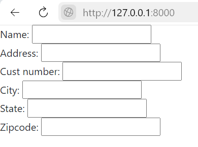
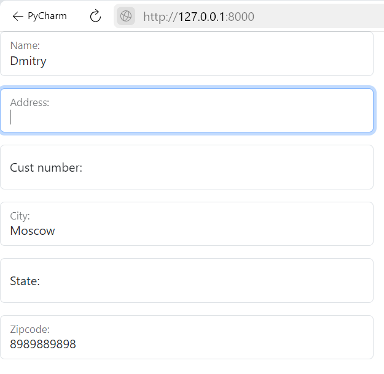
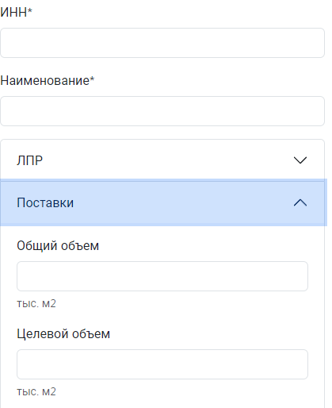

## Введение

Хотя в настоящее время большой популярностью пользуется клиентский рендеринг веб-интерфейсов, Django с «батарейками» в комплекте предоставляет широкий функционал для server-side рендеринга, который позволяет быстро реализовывать интерфейсы решающие задачи бизнеса.

В этой статье я хочу поговорить о существующих подходах к рендерингу веб-форм в Django.

## Проблема

Для демонстрации будем использовать простую модель:

```python
# models.py
class Customer(models.Model):
    name = models.CharField(max_length=50)
    address = models.CharField(max_length=200)
    cust_number = models.IntegerField(blank=False, null=False)
    city = models.CharField(max_length=50)
    state = models.CharField(max_length=50)
    zipcode = models.CharField(max_length=10)
````

Для работы с формами Django предоставляет модуль forms включающий мета классы, которые позволяют декларативно сгенерировать форму для нашей модели:

```python
# forms.py
class CustomerForm(forms.ModelForm):
    class Meta:
        model = Customer
        fields = '__all__'
```

Создадим простое представление для демонстрации получаемых форм:

```python
# views.py
class CustomerCreateView(CreateView):
    model = Customer
    form_class = CustomerForm
```

Добавим форму в шаблон html страницы:

```python
# customer_form.html



  {{ form }}

```

Поздравляю! Нам потребовалось ровно 4 строчки кода чтобы отрендерить форму включающую множество полей и одна строка, чтобы добавить ее в шаблон (не считаем создание конечной точки http). Но согласитесь, в текущем варианте форма смотрится крайне аскетично:



❌  Отсутствует стилизация форм
✅  Форма генерируется автоматически

Django еще не знает, что мы используем css-фреймворк Bootstrap 5 (хотя вы можете использовать любой другой) для стилизации html страниц.

## Наивное решение

Bootstrap предоставляет широкий набор классов и готовых html сниппетов для использования в шаблонах форм. Первое решение которое приходит на ум: "Давайте добавим нужные элементы прямо в шаблон страницы!".

В таком случае мы берем написание html кода формы на себя, используя сниппеты предоставляемые css библиотекой. Таким образом можно добиться безупречной стилизации формы, контролируя каждый элемент в отдельности. Но есть и недостатки такого подхода. Из одной строки вида: `{{ form }}`, форма разрастается до десятков и даже сотен строк. Мы вынуждены контролировать виджеты, лэйблы, строки подсказок, вывод ошибок валидации и многое другое. При этом переиспользование и поддержка при таком подходе крайне затруднены, поскольку форма создается индивидуально, под конкретную реализацию.

✅  Контролируем стилизацию и шаблон формы
❌  Пишем html шаблон формы вручную под конкретную реализацию

Что то здесь не так, ведь на предыдущем этапе мы задействовали встроенные механизмы рендеринга форм Django, не будем от них отказываться!

## Трудоемкое решение

Чтобы соответствовать принципу DRY и держать логику работы форм в соответствующих классах рассмотрим в другой подход.

Согласно документации для применения стилей Bootstrap элемент `<input>` должен иметь класс `form-label`. Мы можем переопределить поля генерируемые мета классом forms.ModelForm с помощью переменных класса, инициализировав для них виджеты с необходимым атрибутом, например:

```python
# class CustomerForm
 name = forms.CharField(
        widget=forms.TextInput(attrs={'class': 'form-control'}),
    )
```

Правда тогда, нам нужно определить все атрибуты поля самостоятельно, т.к. созданный объект поля переопределит генерируемый автоматически. Поэтому, лучше расширить метод `__init__` как это показано ниже:

```python
# forms.py
class CustomerForm(forms.ModelForm):
    class Meta:
        model = Customer
        fields = '__all__'

    def __init__(self, *args, **kwargs):
        super().__init__(*args, **kwargs)

        for field in self.fields.values():
            field.widget.attrs['class'] = 'form-control'
```

Мы используем встроенные механизмы генерации объявленных полей вызвая родительский метод `__init__()`, после чего, в цикле для каждого виджета поля, добавляем ключ-значение `'class': 'form-control'` в словарь `widget.attrs`. Django будет использовать атрибут `attrs` при рендеринге элемента `<input>`, таким образом мы получим желаемый результат.

Если стилизации элемента `<input>` недостаточно, и необходимо изменять html структуру формы, то можно прибегнуть к другому инструменту. Мета классы форм в Django позволяют переопределить шаблоны используемые для рендеринга, c помощью переменных класса вида template_name_* (например template_name_div или template_name_label в зависимости от переопределяемого шаблона). Таким образом мы сможем отказаться от определения html кода конкретной реализации формы в пользу переопределения многократно используемых шаблонов.

Поставляемые с фреймворком шаблоны хранятся в следующей директории: `venv/Lib/site-packages/django/forms/templates/django/forms`.

Bootstrap использует верстку форм на основе div'ов поэтому за основу нового шаблона возьмем `forms/div.html`. Изменим шаблон для соответствия сниппету Bootstrap:

```html
# div.html
...

  <div class="form-floating mb-3 {{ classes }}">
    {{ errors }}
    {{ field }}
    
      <fieldset>
      {{ field.legend_tag }}
    
      {{ field.label_tag }}
    
    <div class="form-text">{{ field.help_text|safe }}</div>
    </fieldset>
    
      {{ field }}
    
</div>

...
```



Таким образом получен отличный результат, мы сохранили минималистичность шаблона страницы и инкапсулировали рендеринг формы в соответствующий класс, при этом используя встроенные механизмы генерации форм для Django моделей.

✅  Контролируем стилизацию и шаблон формы
✅  Генерируем html шаблон автоматически
❌  Отсутствует кнопка отправки формы и html атрибуты `action` и `method` (определяются в шаблоне)

Но есть и недостатки: мы вынуждены создавать новые шаблоны для конкретных реализаций форм. Как это часто бывает, сообщество Python предлагает готовое решение для продвинутого рендеринга форм в Django.

## Готовое решение

Одно из наиболее популярных решений для рендеринга форм в джанго - пакет **[django-crispy-forms](https://github.com/django-crispy-forms/django-crispy-forms)** (4.9 тыс. звезд на GitHub). Пакет позволяет подключать и использовать готовые библиотеки шаблонов для различных фронтенд фреймворков например [Bootstrap](https://getbootstrap.com/), [tailwind](https://github.com/django-crispy-forms/crispy-tailwind), [Bulma](https://github.com/ckrybus/crispy-bulma) и др.

Crispy предоставляет мощные инструменты для генерации всевозможных вариантов представления формы. Подробнее о всех возможностях crispy вы можете ознакомится в [официальной документации](https://django-crispy-forms.readthedocs.io/en/latest/index.html). Здесь лишь приведу пример формы из реального проекта:

```python
# forms.py
class DecisionMakerForm(forms.ModelForm):
    class Meta:
        model = DecisionMaker
        fields = '__all__'


class CustomerForm(forms.ModelForm):
    FIELD_GROUPS = {
        'main': ('status', 'inn', 'name'),
        'decision_maker': (*DecisionMakerForm().fields.keys(), 'source'),
        'shipment': ('total_volume', 'target_volume', 'current_supplier',
                     'consumed_items', 'problematic', 'purchase_method'),
        'other': ('note', ),
    }

    class Meta:
        model = Customer
        fields = '__all__'

    def __init__(self, *args, form_action: Optional[str] = None, **kwargs):
        super().__init__(*args, **kwargs)

        status = forms.ModelChoiceField(
            initial=CustomerStatus.objects.first(),
            required=True,
            queryset=CustomerStatus.objects.all(),
            label=self._meta.model.status.field.verbose_name,
        )
        self.fields['status'] = status

        # Добавляем поля DecisionMakerForm
        self.fields.update(DecisionMakerForm().fields)

        # Добавляем атрибут helper для рендеринга формы с помощью crispy
        self.helper = FormHelper()
        self.helper.form_id = 'id-customer-form'
        self.helper.form_method = 'post'
        self.helper.form_action = form_action
        self.helper.layout = Layout(
            Fieldset('', *self.FIELD_GROUPS['main']),
            Accordion(AccordionGroup('ЛПР', *self.FIELD_GROUPS['decision_maker']),
                      AccordionGroup('Поставки', *self.FIELD_GROUPS['shipment']),
                      css_class='mb-3'),
            Fieldset('', *self.FIELD_GROUPS['other']),
            Submit('submit', 'Сохранить', css_class='float-end'),
        )
```

В этом примере, при инициализации объекта формы, мы добавляем атрибут `helper` который ссылается на объект класса `FormHelper` предоставляемого пакетом `crispy`. С помощью класса `FormHelper` мы можем определить html атрибуты элемента `<form>`, такие как метод и url используемые при отправке формы. Таким образом мы инкапсулируем всю логику работы формы в соответствующий класс не распыляя ее части по html шаблонам.

Но наибольший интерес представляет входящий в состав библиотеки класс `Layout`. Это по настоящему мощный инструмент для конфигурирования шаблона формы. С помощью комбинирования python-объектов отображающих сниппеты bootstrap мы можем объявить сложные шаблоны форм, оставив работу по рендерингу html кода алгоритмам.

В примере мы используем группы полей (`Fieldset()`), аккордеон bootstrap c двумя вкладками (объекты `Accordion()` и `AccordionGroup()`)  даже кнопку подтверждения (`Submit()`). При этом в шаблоне мы лишь определяем место расположения формы, а всю логику связанную с ней определяем в соответствующем классе:

```html
# customer_form.html




  <div class="col-4">
    
  </div>

```



✅  Контролируем стилизацию и шаблон формы
✅  Генерируем html шаблон автоматически
✅  Объявляем кнопку отправки формы и атрибуты `action` и `method`

## Заключение

Выбор подхода зависит от требований проекта и предпочтений разработчика. Однако, использование готовых решений, таких как django-crispy-forms, может значительно упростить процесс разработки и поддержки форм, обеспечивая при этом выполнение принципа DRY, гибкость, контроль над стилизацией и структурой формы.